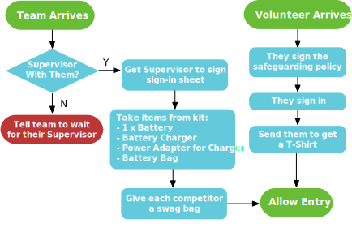

---
original:
  authors: Jeremy Morse, Rob Gilton and Sean Bedford
  url: https://github.com/srobo/comp-team-coord-docs/blob/master/RoleDescriptions/reception.md
  extra: |
    The original work is based on work done by Jeremy Morse, which was under the
    Creative Commons Attribution 4.0 License.  To view a copy of this license,
    visit <a href="https://creativecommons.org/licenses/by/4.0/">https://creativecommons.org/licenses/by/4.0/</a>.
---
# Reception Volunteer

Reception staff control entry to the building and validate people's Media Consent Forms (MCFs) and/or wristbands. Each reception staffer has their own desk and chair.

Here is a flow chart summarising the details below:

**Everyone** must complete a Media Consent Form, Under 16's must have this form completed by a parent or guardian. Please strongly dissuade them from rejecting media consent, as it causes a lot of pains with regards to taking photos of the event. however, they do have the right to reject it. In that case, give them a red lanyard to wear the entire time, in addition to a wristband.

At the start of the competition day, there will be four reception staffers
covering the entrance. Once the initial influx of people is complete, this
will reduce. Additionally, after the initial influx, receptionists
should allow people wearing SR wristbands to enter the building at will (they
should check that people walking in have one, or follow the procedure above).

Throughout the competition, receptionists will likely get a lot of questions by the public. Feel free to answer, and refer any technical or kit questions
to the helpdesk. Any member of the public should be allowed into the building if they sign a Media Consent Form.

# Handling Team Arrivals
When a team first arrives or leaves, your role as reception is to log this and confiscate items on entry, see below:

* Team entry/exit recording
 	* Arrival desk staff will have sign-in / sign-out sheet for team supervisors to
record that their teams have arrived and when they leave. Reception will direct
team supervisors and robot kit to the desk; you should get the team supervisor to sign the sheet.
* Removing batteries, chargers, and bags:
 	* When on-site, we handle battery charging and robot safety, this means we should take all of the following items from each team:
 		* 1 x Battery (Teams have 2 batteries, please take their least-bulgy one).
 		* 1 x Battery charger.
		* 1 x Battery charging bag.
		* 1 x Battery charging power supply unit (PSU).

# Handling Volunteer Arrivals
Volunteers will be turning up throughout the competition, it's important to make sure they do what is needed before entering:
- Strongly recommend that they wear a face covering.
- Ensure they have filled out an MCF.
- Ensure they have signed the safeguarding policy.
- Ensure they sign in on the sign-in sheet.
- They need to be provided with a t-shirt.

## Required Items

You should have the following items present for your duties. If you do not, please let the competition team coordinator know as soon as possible.

* Spare Media Consent Forms (MCFs) to allow visitors to enter.
* Pens to fill in forms.
* Wristbands to give to entrants.
* Competitor booklets to give to teams.
* Venue maps.
* Guest visitor flyers.
* This documentation and flow chart.
* Sign-in/out sheet.
* Boxes to store battery charging kits.
