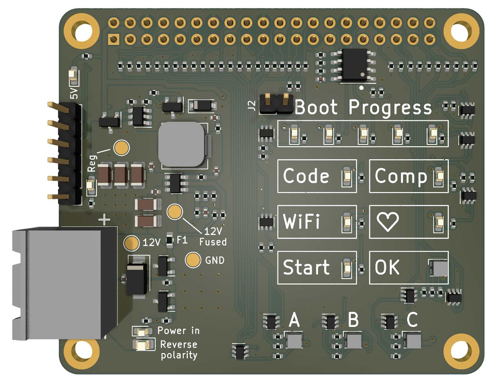

# KCH (Raspberry Pi HAT)

## KCH LEDs

The LEDs on the KCH are split into several groups, some indicate the power state of the KCH, some indicate the state of the robot and some are directly controlled by student code.

### Power Supply

- `5V` (Green)
    - 5V power is present, whether from the USB-C port on the Pi or the KCH regulator.
- `Reg` (Green)
    - The regulator on the KCH is enabled.
- `Power in` (Green)
    - 12V power is present on the 12V input.
- `Reverse polarity` (Red)
    - The 12V power input has reversed polarity.

### Boot Progress LEDs

There are 5 green LEDs that are a "progress bar" of boot progress on the KCH. Each represents a different stage of boot:

- 20%
    - Connected to GPIO 7, which is configured as [SPI0 CE1 (ALT0)](https://pinout.xyz/pinout/pin26_gpio7)
    - It is configured in the [KCH EEPROM](https://github.com/srobo/kch-hw/blob/main/EEPROM/eeprom_settings.txt#L69).
    - In normal behaviour, it turns on when the EEPROM device tree overlay is loaded, i.e in the early stages of the kernel.
    - This LED indicates that the SD card can be read and that the operating system is loading.
    - This LED will turn on with any valid Raspberry Pi distro.
- 40%
    - This LED is turned on by [`boot_40.service`](https://github.com/srobo/robot-image/blob/main/sources/meta-srobo/recipes-robot/python-astoria/astoria-config/boot_40.service), which runs in the early stages of systemd (`basic.target`).
    - This LED indicates that the filesystem structure on the SD card is valid.
    - It also indicates that the SD card contains a Student Robotics OS image.
- 60%
    - This LED is controlled by [`kchd`](../../software/#kch-daemon-kchd) and indicates `kchd` is running.
    - If this LED has turned on, most of the operating system is loaded and behaving correctly.
- 80%
    - This LED is turned on when `kchd` has connected to the MQTT broker.
    - This indicates that the robot's event bus is functioning.
- 100%
    - This LED is turned on when all critical astoria services are loaded and running.
    - It will turn off if any of the services stop or crash.

### Status LEDs

The following LEDs are driven by GPIO on the Raspberry Pi and indicate the status of the robot.

All except the `Start` and Heartbeat LED are controlled by [`kchd`](../../software/#kch-daemon-kchd). If `kchd` is not running, these LEDs will not light up. Check the 60% boot progress LED to confirm that `kchd` is running.

- `Code` (Green)
    - Enabled when a USB drive containing a usercode file (`robot.py`) is mounted.
- `Comp` (Blue)
    - Enabled when the `mode` key in the robot metadata is `COMP`.
    - This does not indicate that the arena marker offset is enabled, or that the WiFi is disabled.
- `WiFi` (Blue)
    - Enabled when the WiFi Access Point is running.
- Heartbeat (Blue)
    - Uses the [Heartbeat LED trigger](https://github.com/torvalds/linux/blob/master/drivers/leds/trigger/ledtrig-heartbeat.c) in the Linux kernel to indicate that the kernel is running.
    - In normal operation flashes like a heartbeat, i.e thump, thump, pause...
    - If the LED stops flashing, this indicates that the kernel has stopped.
    - The LED is configured using the [device tree overlay](https://github.com/srobo/kch-hw/blob/main/EEPROM/heartbeat.dts) in the EEPROM of the HAT.
- `Start` (Green)
    - Flashes at the same time as the run LED on the power board when the robot is ready to start.
    - It is driven directly from `sr.robot3`.
- `OK` (RGB)
    - This LED indicates the `CodeStatus` of `astprocd`.
    - Each state corresponds to a particular colour, listed in a [table in the docs](https://studentrobotics.org/docs/kit/brain_board/#ok-led).

### RGB LEDs

There are three user controllable RGB LEDs on the KCH, `A`, `B`, and `C`.

These LEDs are driven directly from `sr.robot3`.

## Headers

There are three headers on the KCH, one is for attaching to the Raspberry Pi, the other two are usually unpopulated.

### EEPROM Write Enable (J2)

This jumper shorts the write protect pin on the EEPROM to GND, so that it can be reprogrammed.

### Serial Header

This 6 pin header located on the left hand side of the board exposes `GND`, and the UART `TX` and `RX` lines from the Raspberry Pi GPIO.

Whilst it's not populated, it may be useful to have it populated on a development board for bootloader debugging.